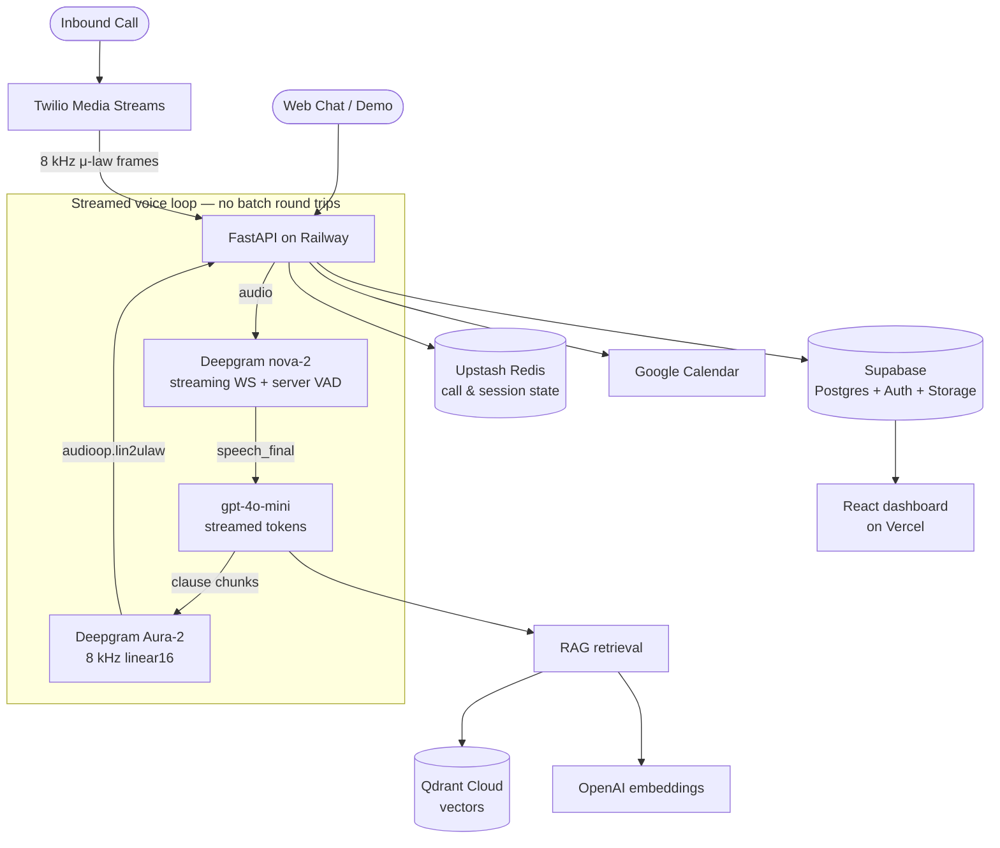

# NexaDesk — AI Receptionist for Real Estate

[](https://github.com/shaheersalal/nexadesk/actions/workflows/ci.yml)
[](https://www.python.org/downloads/)
[](https://fastapi.tiangolo.com/)
[](https://railway.app/)

> A 24/7 AI receptionist that answers inbound property calls and website chat,
> qualifies leads, answers questions from the agency's own documents, and books
> viewings — without a human in the loop.

**Live now:**

| | |
|---|---|
| 🎙️ **Interactive demo** (talk to it) | **https://nexadesk-1j2y.vercel.app** |
| 📊 **Product site + dashboard** | **https://www.nexadesk.site** |
| ⚙️ **API** (52 routes, OpenAPI UI) | **https://nexadesk-api-production.up.railway.app/docs** |

---

## What it does

- **Answers inbound phone calls** with a fully streamed voice pipeline — no
  turn-taking dead air.
- **Answers website chat** using the same prompt, model and rate limits as the
  phone line, so the demo and the product cannot drift apart.
- **Retrieval-augmented answers** grounded in each agency's own uploaded
  documents and property listings, not in the model's general knowledge.
- **Captures and scores leads** automatically into a multi-tenant dashboard.
- **Books viewings** through the Google Calendar API.
- **Exposes an MCP server** so the agency's own AI tooling can query leads,
  properties and appointments directly.

## Architecture



## Engineering decisions worth reading

These are the choices that were expensive to get right, and that a casual
rewrite would quietly undo.

**The voice pipeline is streamed end to end.** Deepgram's streaming WebSocket
with server-side VAD emits `speech_final`, LLM tokens stream as they generate,
and TTS is chunked on clause boundaries. The earlier request/response design
carried 2.5–4.5 seconds of silence per turn, which is the difference between a
conversation and a hold queue.

**Telephony is optional, and not mounting the route is the security control.**
With no Twilio credentials there is no way to validate a webhook signature, so
the safe state is for `/voice/*` not to exist rather than to exist and accept
unsigned requests. Supplying exactly one of the two credentials is a hard
startup failure — a half-configured phone line fails loudly instead of quietly.

**Unrecognised inbound numbers resolve to `None`.** There is deliberately no
"fall back to the first company" path; that leaked one agency's knowledge base
into another agency's call.

**Tokens are verified against Supabase's JWKS, and each branch pins its
algorithm.** Supabase issues ES256; the legacy HS256 secret remains only as a
fallback. The token's own `alg` header is never trusted to select the verifier.

**Tenant isolation is explicit.** The backend uses the Supabase service-role
client and therefore bypasses RLS, so every query carries a hand-written
`company_id` filter. This is written down precisely because it is the kind of
invariant that erodes silently.

**`TRUST_PROXY_HEADERS` defaults to false.** Honouring `X-Forwarded-For` without
a proxy that overwrites it makes every per-IP rate limit forgeable by the
client.

## Tech stack

| Layer | Technology |
|---|---|
| Backend | FastAPI, Python 3.12 (no Docker — Nixpacks) |
| LLM | OpenAI `gpt-4o-mini` |
| Speech-to-text | Deepgram `nova-2` (streaming) |
| Text-to-speech | Deepgram Aura-2 (pluggable; ElevenLabs supported) |
| Embeddings | OpenAI `text-embedding-3-small` (1536-dim) |
| Vector DB | Qdrant Cloud |
| Database / auth / storage | Supabase (PostgreSQL, ES256 JWT) |
| Call & session state | Upstash Redis |
| Telephony | Twilio Media Streams |
| Calendar | Google Calendar API |
| Dashboard | React 18, Vite, Tailwind (Vercel) |
| Demo app | Next.js 14 (Vercel) |
| Hosting | Railway |

## Language support

**English only at present.** Deepgram Aura has no Arabic or Urdu voice, so
offering those languages meant returning text with silence where the spoken
reply should be. `SUPPORTED_LANGUAGES` widens again alongside an ElevenLabs
key — the TTS provider is already pluggable and requires no code change.

## Local setup

No containers required.

```bash
python -m venv .venv
source .venv/Scripts/activate      # PowerShell: .\.venv\Scripts\Activate.ps1
pip install -r requirements.txt

cp .env.example .env               # then fill in your keys
uvicorn app.main:app --reload --port 8000
```

OpenAPI UI at `http://localhost:8000/docs`.

### Key environment variables

```bash
LLM_API_KEY=            # OpenAI — powers gpt-4o-mini
EMBED_API_KEY=          # OpenAI — embeddings
STT_API_KEY=            # Deepgram — used for BOTH nova-2 STT and Aura TTS
TTS_PROVIDER=deepgram   # deepgram | elevenlabs | auto
TTS_API_KEY=            # ElevenLabs only; leave empty to stay on Deepgram
SUPABASE_URL=           # Supabase project URL
SUPABASE_SERVICE_KEY=   # service-role key (bypasses RLS — see above)
QDRANT_URL=             # Qdrant Cloud URL (local dev: QDRANT_HOST + QDRANT_PORT)
QDRANT_API_KEY=
REDIS_URL=              # Upstash, rediss://
APP_SECRET_KEY=         # keys CRM OAuth token encryption; app refuses the placeholder
TELEPHONY_ACCOUNT_SID=  # Twilio — both or neither, never one
TELEPHONY_AUTH_TOKEN=
```

`.env.example` lists the full set.

## Tests and CI

```bash
pytest -q                       # 53 tests
ruff check app/ tests/ scripts/ # pinned to 0.16.2
python -m compileall -q app/
```

CI runs lint, a full `compileall`, an import check that exercises the startup
validation path, and the test suite on every push.

> The compile step previously ended in `and False`, so it printed a count and
> passed unconditionally without parsing a single file. `AUDIT.md` tracks that
> and 33 other findings, with the reasoning for the ones left open.

## Documentation

| File | What's in it |
|---|---|
| [AUDIT.md](AUDIT.md) | 34 findings, what was fixed and why the rest were not |
| [DEPLOYMENT.md](DEPLOYMENT.md) | Deploy and operations runbook |
| [FLOWS.md](FLOWS.md) | Request and data flows |

## Status

Live in production since 2026-08-17. Voice is code-complete and covered by
tests; the phone line activates once Twilio KYC clears and a number is attached.
