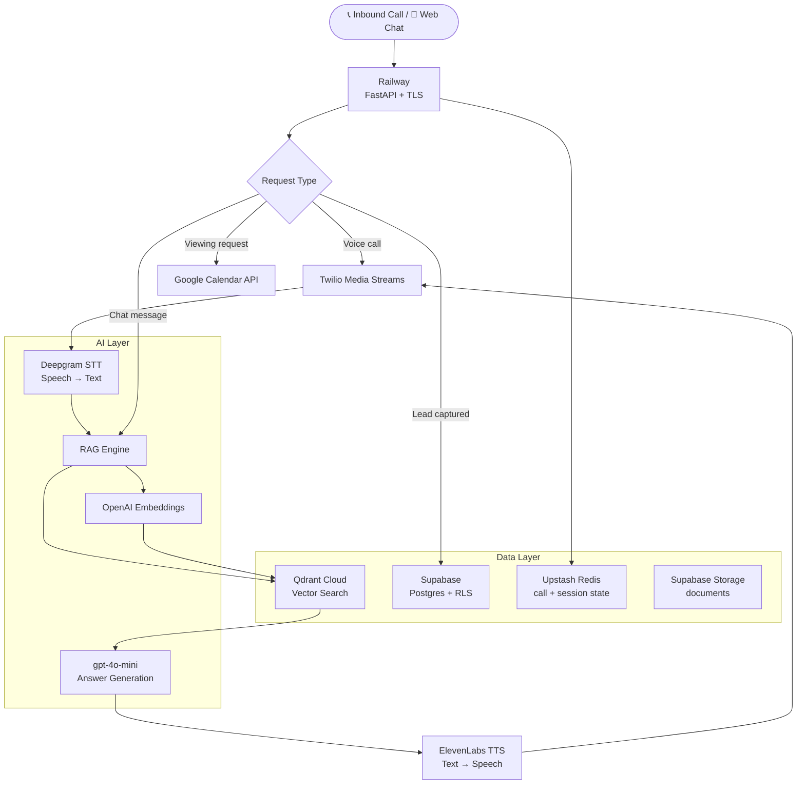

# NexaDesk — AI Receptionist for Real Estate

> 24/7 AI receptionist that handles inbound property enquiries via voice and chat. Qualifies leads, answers FAQs, and books viewings — without a human.

## What It Does

- **Voice calls** — answers inbound calls, understands the caller, qualifies interest (budget, timeline, property type)
- **RAG-powered FAQs** — answers property-specific questions from the agency's knowledge base
- **Lead capture** — extracts and stores lead details automatically into a CRM-style dashboard
- **Viewing bookings** — integrates with Google Calendar to schedule appointments
- **Multi-language** — supports English, Arabic, Urdu, French, Spanish
- **Admin dashboard** — manage properties, review leads, upload knowledge base documents

## Architecture



<details>
<summary>Text diagram</summary>

```
Browser / Phone Call
        ↓
    Railway (TLS, autoscaling)
        ↓
    FastAPI (Python)
     ├── /voice      ← Twilio webhook handler, STT, TTS
     ├── /chat       ← WebSocket chat endpoint
     ├── /leads      ← Lead capture + Google Calendar
     ├── /properties ← Property listings management
     ├── /rag        ← Document ingestion + vector search
     └── /auth       ← JWT authentication
        ↓
   ┌────────────────────────────────┐
   │  gpt-4o-mini (LLM)             │
   │  Deepgram (Speech-to-Text)     │
   │  ElevenLabs (Text-to-Speech)   │
   │  OpenAI Embeddings             │
   └────────────────────────────────┘
        ↓
   ┌────────────────────────┐
   │  Qdrant Cloud (vectors)│
   │  Supabase (Postgres)   │
   │  Upstash Redis (state) │
   └────────────────────────┘
```

</details>

## Tech Stack

| Layer | Technology |
|---|---|
| Backend | FastAPI, Python 3.12 |
| LLM | OpenAI gpt-4o-mini |
| Voice STT | Deepgram nova-2 |
| Voice TTS | ElevenLabs |
| Embeddings | OpenAI text-embedding-3-small |
| Vector DB | Qdrant Cloud |
| Database | Supabase (PostgreSQL + RLS) |
| Cache / call state | Upstash Redis |
| Telephony | Twilio |
| Calendar | Google Calendar API |
| Frontend | React, Tailwind CSS, Vite (Vercel) |
| Infrastructure | Railway (Nixpacks) |

## Setup

No containers required.

```powershell
python -m venv .venv
.\.venv\Scripts\Activate.ps1
pip install -r requirements.txt

cp .env.example .env
# Fill in your API keys in .env

uvicorn app.main:app --reload --port 8000
```

API docs available at `http://localhost:8000/docs`.
Deployment details in [DEPLOYMENT.md](DEPLOYMENT.md).

## Environment Variables

See `.env.example` for all required variables. Key ones:

```
LLM_API_KEY=          # Anthropic Claude API key
STT_API_KEY=          # Deepgram API key
TTS_API_KEY=          # ElevenLabs API key
EMBED_API_KEY=        # OpenAI API key (embeddings)
TELEPHONY_ACCOUNT_SID= # Twilio SID
SUPABASE_URL=         # Supabase project URL
QDRANT_HOST=          # Qdrant host
```

## Status

MVP — built for real estate agencies to handle inbound enquiries autonomously.
